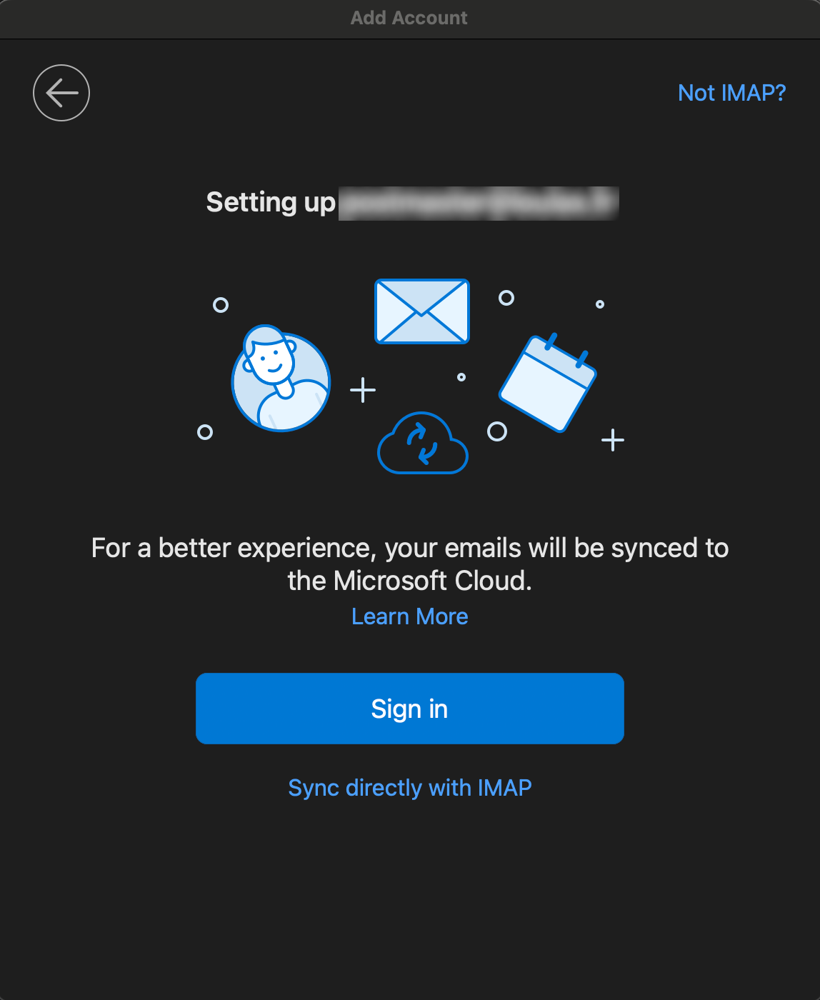

## Connexion outlook ou thunderbird

Afin de faciliter la majorité des utilisateurs habitué à utiliser outlook ou thunderbird (pour les clients bureau), voici comment se connecter au serveur mail mx1.loulax.fr.

Voici le tableau des informations de connexion au serveur:

| Nom du champs                | Valeur                                |
| ---------------------------- | ------------------------------------- |
| Email                        | Votre adresse mail                    |
| Mot de passe                 | Mot de passe lié à votre adresse mail |
| Serveur entrant / nom d'hôte | mx1.loulax.fr                         |
| Port                         | 993                                   |
| Méthode de connexion         | Mot de passe normal                   |
| Sécurité de connexion        | SSL/TLS                               |
| Serveur sortant / nom d'hôte | mx1.loulax.fr                         |
| Port                         | 465                                   |
| Méthode de connexion         | Mot de passe normal                   |
| Sécurité de connexion        | SSL/TLS                               |

## Procédure pour Outlook

Quand outlook est ouvert, dans le mneu en haut cliquer sur Outlook > Settings > Accounts.

Sur la capture suivante, il sera listé tous les comptes mails précédemment configurés. Pour en ajouter un nouveau cliquer sur Add Account.

Saisissez l'adresse mail à ajouter.

Bien faire attention ici à cliquer sur sync directly with imap.

Puis renseigner ici les différentes informations telles que votre email et mot de passe ainsi que les paramètres du serveur.

## Procédure pour Thunderbird

La procédure est relativement similaire à Outlook si ce n'est que les menus changent. Sur thunderbird pour accéder aux comptes, cliquer sur Thunderbird > paramètres des comptes.

Ici cliquer sur compte de messagerie

Sur cette capture il faudra renseigner lesi nformations d'authentification. Attention pour afficher les paramètres supplémentaires, il faudra cliquer sur "Configuration manuelle" qui s'affichera en bas du formulaire une fois l'email et mot de passe renseigné.

