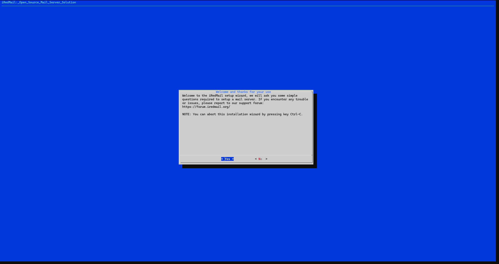
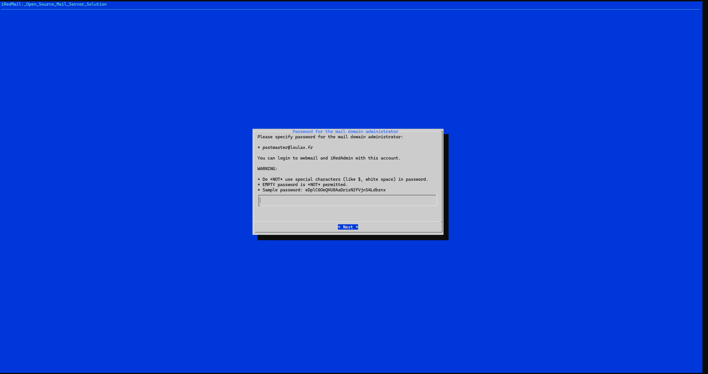

# Configuration d'un serveur mail avec iredmail sous debian


Iredmail est un outil gratuit avec une version payante pour plus de fonctionnalités mais la version gratuite permet déjà de faire bcp de choses.

Il peux s'installer sous n'importe quelle distribution linux.

Je vais l'installer sur une vm sur un proxmox dans un réseau que j'ai dédié à mon lab en 10.1.1.0/28, la vm à les caratéristiques suivantes:

OS: Debian 12.5
HDD : 82Go
CPU : 4 Coeurs
RAM: 4Gb
1x Ethernet (vmbr1)

<u>Version d'iRedMail installé (dernière stable) pour l'instant : 1.7.1</u> (09/11/2024)

Dans cette documentation, je vais configurer un serveur mail qui répondra pour le domaine mx1.loulax.fr (cette information est primordiale pour la suite).

Je précise que ce serveur mail sera derrière un reverse-proxy nginx avec bind, les 2 se trouvent sur l'hôte proxmox. 

## 1) Préparation de la machine

 Cette étape consiste à installer simplement l'OS et préparer la machine pour avoir tous les prérequis nécessaires à l'installation d'iRedmail.
Je passe l'installation de debian, j'ai choisi les paramètres les plus standard.

Une fois que l'installation est terminée, il va falloir modifier le contenu des fichiers suivants :

```
### /etc/hosts ###
root@mx1:~# cat /etc/hosts
127.0.0.1       mx1.loulax.fr mx1 localhost
<ip vm>         mx1.loulax.fr mx1 localhost

# The following lines are desirable for IPv6 capable hosts
::1     localhost ip6-localhost ip6-loopback
ff02::1 ip6-allnodes
ff02::2 ip6-allrouters
```

```
### /etc/hostname ###
mx1
```

Une fois que c'est fait, il va falloir redémarrer la machine afin qu'elle prenne en compte le nouveau hostname.

## 2) Installation du serveur

Maintenant, il va falloir se rendre sur le site de l'outil, dans la section téléchargement pour récupérer l'archive : 

https://iredmail.com/download.html

Faire un clique droit sur le bouton "Version stable" et copier le lien.

Ensuite retourner sur le terminal puis saisir les commandes suivantes :

```
wget https://github.com/iredmail/iRedMail/archive/refs/tags/1.7.1.tar.gz
tar zxvf 1.7.1.tar.gz
cd iRedMail-1.7.1
chmod +x iRedMail.sh
./iRedMail.sh
```

Le script va se lancer et une fenêtre de dialogue va apparaître pour répondre à différentes questions.



Ensuite Next


Je choisi ici MariaDB mais vous pouvez utiliser OpenLDAP si vous avez un annuaire LDAP ou PSQL sur la machine.


Il faudra dans les capture suivante mettre un mot de passe pour les utilisateurs de la base de donnée et postmaster@domain.tld


Il faudra ici pour ceux qui ont un sous-domaine comme moi mettre le domaine racine (très important !)


Dans la capture suivante ce sera le mot de passe du compte postmaster qui sera l'administrateur global d'iredmail.



**<u>Je conseille fortement pour les comptes de mettre des mots de passe robuste d'environ 30 caractères de toute sorte (chiffres, lettres, caratères spéciaux, min, maj)</u>**

Dans la capture suivante, il est proposé différents services dont :

- Roundcube / SOGo (webmails)
- Netdata (Outil de monitoring)
- iRedAdmin : Backend pour gérer le(s) domaine(s) et les comptes mails
- Fail2ban : Un outil qui permet de limiter un petit peu la casse quand un petit coquin se challenge avec hydra ;)


Et enfin répondre par Y pour confirmer les précédents choix.

Une fois l'installation d'iRedMail terminée, il sera demandé si l'on souhaite utiliser nftables pour le port 22.


Pour la toute fin, il va falloir redémarrer la machine pour activer tous les services.

## 3) Configuration de nginx

Dans cette partie, je vais configurer nginx pour permettre de rediriger tout le traffic qui tape l'url mx1.loulax.fr vers la vm.

Voici la configuration :

```

server {

        server_name mx1.loulax.fr;
        listen 80;
        return 301 https://$host$request_uri;
}

server {

        server_name mx1.loulax.fr;
        listen 443 ssl http2;
        include /etc/nginx/ssl_conf_loulax.fr.conf;
        include /etc/letsencrypt/options-ssl-nginx.conf;
        ssl_dhparam /etc/letsencrypt/ssl-dhparams.pem;

        location / {

                proxy_pass https://<ip de la vm>;
                include /etc/nginx/proxy_params;
        }

}

```

Une fois redémarré, si tout s'est bien passé, se rendre à l'adresse et voilà le résultat.


> [!NOTE]
>
> Il est possible que l'on est une erreur too many redirect après avoir redémarré le serveur.

Si c'est le cas, c'est dû au fait que chez OVH par exemple, un script est exécuté au démarrage du serveur qui réécrit dans le fichier hosts et rajoute le hostname initiale. Un exemple ici :

```
root@mx1:/home/debian# cat /etc/hosts
127.0.0.1       mx1.loulax.fr     mx1     localhost
::1     localhost       ip6-localhost   ip6-loopback
ff02::1 ip6-allnodes
ff02::2 ip6-allrouters


127.0.1.1       mx1.loulax.fr     mx1     localhost
-> 127.0.1.1       vps-612219ef.vps.ovh.net        vps-612219ef <- 
```

Il faudra dans ce cas là commenter ou supprimer la ligne et créer une tâche cron qui réécrira par dessus le contenu du fichier pour pas se retrouver de nouveau avec cette erreur.

## 4) Authentification du serveur mail

Dans cette partie qui est la plus importante pour l'envoi et la réception des mails, il va falloir configurer la zone dns de son domaine (si celui-ci est publique) afin de permettre aux autorités comme Google, Microsoft, Cloudflare etc de voir vos mails comme légitime.

Afin que cela soit possible, il va falloir ajouter les enregistrements suivants dans votre zone dns :

- Clé DKIM
- Enregistrement SPF
- Enregistrement dmarc

Pour la clé dkim, dans certains cas, il sera nécessaire de la générer sur le serveur mail mais iRedMail encore une fois a automatisé cette partie pour nous.
Il faudra donc se connecter ici sur SOGo avec le compte postmaster dans lequel 3 mails seront présents, dans le dernier mail se trouvera beaucoup d'informations notamment sur les fichiers de configuration des services et de connexion au serveur.

### Ajout des records au niveau de la zone dns

Il faudra dans cette partie ajouter dans la zone dns du registrar où se trouve le domaine les enregistrements suivants afin que l'envoi et la réception de mail fonctionne:

| type | Nom                 | Contenu                                                 |
| ---- | ------------------- | ------------------------------------------------------- |
| A    | mx1                 | <ipv4 du serveur>                                       |
| TXT  | dkim._domainkey     | "v=DKIM1; p=<cle dkim"                                  |
| TXT  | _dmarc              | "v=DMARC1; p=quarantine; rua=mailto:<email postmaster>" |
| TXT  | @ ou domaine racine | "v=spf1 ip4:<ip du serveur mx -all"                     |
| MX   | @ ou domaine racine | nom du domaine du serveur mail                          |

Pour ceux qui utilise un reverse proxy comme moi, il faut renseigner l'ip publique du reverse proxy qui se chargera de son côté à la redirection.

Il faudra également penser à vérifier dans /etc/postfix/main.cf, si les lignes suivantes correspondent bien au domaine et hostname de la machine afin que le nslookup retourne bien le hostname :

```
myhostname = mydomain
myorigin = mydomain
mydomain = mydomain
```

Bien pensé à redémarrer postfix après avoir modifier le fichier.

### Certificats

Pour cette partie, je vais créer des certificats wildcard avec le script acme.sh disponible à cette adresse :

https://github.com/acmesh-official/acme.sh

Il faudra créer une clé d'api dans son compte cloudflare puis renseigner ces informations dans un fichier par exemple cloudflare.ini:

```
export CF_Token="votre_jeton_api"
export CF_Account_ID="votre_id_compte"
export CF_Zone_ID="votre_id_zone"
```

Récupérer le script  via wget et exécuter les commandes suivantes :

```
#S'enregistrer auprès de acme
./acme.sh --register-account -m mail@exemple.com
#sourcer le fichier cloudflare.ini pour exporter les variables
source ~/cloudflare.ini
#Génération du certificat via l'api de cloudflare
./acme.sh --issue --dns  dns_cf -d "exemple.com" -d "*.exemple.com" --debug
```

Une fois les certificats en sa possession, il va falloir les copier sur le serveur mail pour que ce dernier les utilisent dans les signatures des mails.
Pour ce faire, il faudra récupérer les certificats dans une archive.zip par exemple puis les envoyer sur le serveur mail.

Une fois dessus, décompresser l'archive puis copier la clé de chaîne et la clé privé comme ceci : 

```
cp fullchain.cer /etc/ssl/certs/iRedMail.crt
cp loulax.fr.key /etc/ssl/private/iRedMail.key
```

Il faudra ensuite redémarrer nginx pour qu'il puisse prendre en compte les nouveaux certificats.

## 5) Sauvegarde / Restauration des mails

### Backup

iRedmail sauvegarde automatiquement chaque compte mail grâce à un script situé dans **<u>"/var/vmail/backup/backup_mysql.sh"</u>** et est appelé via une tâche cron qui est exécuté tous les jours à 3:30am dont un mail est également envoyé à postmaster@<domain>.<tld> à chaque fois que celle-ci est exécuté pour avertir.

Les backups des mails sont stockées et compressées ici dans une archive bunzip2: 

```
/var/vmail/backup/mysql/YYYY/MM/dd
```

Il est possible de garder aussi la même clé dkim afin de ne pas à devoir systématiquement mettre à jour l'enregistrement dns pour chaque nouvelle restoration.
Par défaut la clé dkim se trouve dans :

```
/var/lib/dkim/
```

Il faudra par conséquent remettre cette même clé avec le nom exacte.

**<u>Il est préférable de faire une backup complète du répertoire /var/vmail puis ensuite restaurer les fichiers dont on a besoin par la suite.</u>**

### Restauration

Il faudra restaurer la base de donnée en revanche, <u>attention à ne pas ré-injecter le fichier mysql qui contient les anciens identifiants de postfix, dovecot et Roundcube/SOGo car ces derniers sont susceptibles d'être différents sur la nouvelle installation ce qui pourrait causer des problèmes de fonctionnement dû à des identifiants incorrectes</u>.

Pour restaurer les mails en tant que tel, il faudra copier le répertoire /var/vmail/vmail1 exactement au même endroit. Attention il est possible si l'on utilise la commande scp que la copie bloque pour des raisons de droit. Il faudra dans ce cas passer provisoirement le répertoire en chmod 777 pour l'envoyer sur le serveur distant ensuite remettre les droits appropriés en locurrence pour le répertoire /var/vmail/vmail1 comme ceci:

```
chmod -R 700 /var/vmail/vmail1
chown -R vmail:vmail /var/vmail/vmail1

chmod -R 755 /var/vmail/backup
chown -R root:root /var/vmail/backup
```

Ensuite pour réimporter les données dans la base, il faudra se rendre dans le répertoire **<u>"/var/vmail/backup/mysql/YYYY/MM/DD"</u>**. De préférence dans le dossier avec la date la plus proche du jour de la restauration (normalement le jour même ou la veille).

Puis extraire les archives et réimporter en base avec les commandes suivantes:

```
bzip2 -d archive.sql.bz2 
mysql -u root -p <db_name> < archive.sql
```

Il existe un cas dans lequel on a 2 serveurs mails et on voudrait migrer les mails d'un serveur à l'autre.
Pour ce faire, il va falloir procéder de la sorte:

1) Sauvegarder uniquement le répertoire du domaine concerné situé dans /var/vmail/vmail1/<domain>.<tld> et faire un export filtré de la base de donnée vmail :

   ```sql
   mysqldump --opt --no-create-info --databases vmail --tables domain mailbox --where="domain='<domain>.<tld>'" > /root/<backup_vmail.sql
   ```

2) Envoyer les fichiers sur le serveur 2

3) Copier le répertoire vmail1/<domain>.<tld> dans /var/vmail/vmail1 et remettre les droits sur le répertoire vmail/vmail1/<domain>.<tld>

4) Réimporter la base vmail 

   ```
   mysql -u root -p vmail < vmail_backup.sql
   ```

5. Passer ensuite à l'étape 6 pour la gestion de multiples domaines sans faire l'ajout du domaine dans iredadmin car c'est déjà fait via l'import sql, passer directement à la configuration des services postfix et amavis

## 6) Gestion de multiples domaines dans iRedmail

****

Pour l'ajout d'un domaine supplémentaire dans iRedMail, il faudra suivre les mêmes étapes concernant l'ajout d'un certificat ainsi que des dns.

Il faut savoir que dans le fichier hosts il n'est pas nécessaire de pointer chaque domaine ajouté, juste un seul suffit pour faire office de reverse.

Etape 1 : Configurer  iredadmin, postfix et amavisd

Se rendre dans la console iredadmin pour ajouter le domaine, se connecter à l'adresse suivante :

https://<mydomain>.tld/iredadmin

Puis aller dans "<u>Add</u>" > "<u>Domain</u>" et suivre les étapes.

Une fois fait, il faudra modifier le fichier de configuration /etc/amavis/conf.d/50-user:

```
# Ajouter la ligne suivante
dkim_key('<domain.tld>', 'dkim', '/var/lib/dkim/domain.tld');
```

Puis ajouter la ligne suivante dans la section "<u>dkim_signature_options_bysender_maps</u>":

```
"domain.tld" => { d => "domain.tld", a => "rsa-sha256", ttl => 10*24*3600 }
```

**<u>Attention: Ici il faut renseigner le domaine racine et pas le sous domaine si ajouté éventuellement comme là pour le hostname du serveur mx1.loulax.fr, il faut spécifier loulax.fr</u>**

Ensuite il faudra générer la clé dkim avec la commande suivante :

```
amavisd genrsa /var/lib/dkim/domain.tld.pem
```

Ensuite il faudra configurer nginx pour gérer l'autre domaine:

```
touch /etc/nginx/sites-enabled/<domaine.tld>.conf
cat /etc/nginx/sites-enabled/00-default.conf | tee -a /etc/nginx/sites-enabled/domain.tld.conf
cat /etc/nginx/sites-enabled/00-default-ssl.conf | tee -a /etc/nginx/sites-enabled/domain.tld.conf
cp /etc/nginx/templates/ssl.tmpl /etc/nginx/templates/ssl-domain.tmpl
```

Enfin éditer le fichier de configuration du domaine fraîchement créé et remplacer les lignes suivantes :

```
server_name _; => server_name <domain.tld>;
include /etc/nginx/templates/ssl.tmpl; => include /etc/nginx/templates/ssl-msft.tmpl;
```

Puis redémarrer les différents services :

```
systemctl restart nginx dovecot nginx sogo amavis
```

Dans le doute, redémarrer complètement le serveur pour s'assurer que tous les services ont bien pris en compte les dernières modifications.

Enfin, il faudra, il faudra se rendre dans la console de gestion de sa zone dns liée au domaine pour permettre d'ajouter les différents enregistrements nécessaires comme cité dans le tableau au dessus.

## 7) Automatisation

Déploiement d'iRedmail via docker:

Créer un répertoire iredmail à la racine du serveur et créer ensuite l'arborescence de dossiers pour iredmail comme suit :

```
mkdir -p data/{backup-mysql,clamav,custom,imapsieve_copy,mailboxes,mlmmj,mlmmj-archive,mysql,sa_rules,ssl,postfix_queue}
```

Générer un token avec openssl : openssl rand -base64 24

Ensuite créer un fichier nommé par exemple iredmail-docker.conf et y insérer les valeurs suivantes :

```
HOSTNAME=mail.domain.tld
FIRST_MAIL_DOMAIN=domain.tld
FIRST_MAIL_DOMAIN_ADMIN_PASSWORD=<StrongPassword>
MLMMJADMIN_API_TOKEN=3kzP+I+ObUJOp1pPVEIc214Q7gzE/RHfxUS28X0QdzA=
SOGO_DES_KEY=oDFFLh+kSftdm0PjyZQ1sm0DJ40t4EUL
```

### Gestion de multi domains 

Dans cette partie j'ai opté pour une solution avec docker qui consiste à avoir un container qui se trouvera dans le même réseau que le container d'iredmail. Le container tournera à temps plein et analysera un fichier dans lequel se trouveront tous les domaines et à chaque fois qu'un nouveau domaine sera trouvé il vérifiera avec une requête dans la base de donnée d'iredmail si ce dernier est déjà présent sinon il ajoutera le domaine en question en créer les arborescences au niveau du système de fichier et dans la base de donnée.

Il faudra créer les ficheirs suivants :

```
Dockerfile add_domain.py config.env docker-compose.yml domain.txt requirements.txt start.sh
```

Contenu du Dockerfile:

```
FROM python:3.11

# Installer les dépendances
WORKDIR /app
COPY requirements.txt .
RUN pip install --no-cache-dir -r requirements.txt

# Copier les fichiers du projet
COPY add_domain.py .
COPY start.sh .
COPY domains.txt .
COPY config.env .

# Rendre le script exécutable
RUN chmod +x start.sh

# Commande de démarrage
CMD ["./start.sh"]
```

Contenu du fichier config.env

```
# MySQL
MYSQL_HOST="iredmail"
MYSQL_USER="root"
MYSQL_PASSWORD="" -> Le mot de passe du compte root du container iredmail
MYSQL_DB="vmail"
```

Contenu du fichier docker-compose.yml:

```
version: "3.8"

services:
  iredmail-auto:
    build: .
    container_name: iredmail-auto
    restart: always
    volumes:
      - ./domains.txt:/app/domains.txt
      - ./config.env:/app/config.env
    networks:
      - mail_network
    env_file:
      - config.env

networks:
  mail_network:
    external: true
```

requirements.txt :

```
mysql-connector-python
requests
python-dotenv
```

start.sh :

```
#!/bin/bash
echo " Lancement du gestionnaire de domaines iRedMail..."
python3 add_domain.py
```

add_domain.py:

```py
import os
import mysql.connector
import time
import requests
from dotenv import load_dotenv

# Charger les variables d'environnement
load_dotenv()

# Configuration MySQL
MYSQL_HOST = os.getenv("MYSQL_HOST")
MYSQL_USER = os.getenv("MYSQL_USER")
MYSQL_PASSWORD = os.getenv("MYSQL_PASSWORD")
MYSQL_DB = os.getenv("MYSQL_DB")

def connect_db():
    return mysql.connector.connect(
        host=MYSQL_HOST,
        user=MYSQL_USER,
        password=MYSQL_PASSWORD,
        database=MYSQL_DB
    )

def get_existing_domains():
    """ Récupère les domaines déjà présents dans la base de données. """
    db = connect_db()
    cursor = db.cursor()
    cursor.execute("SELECT domain FROM domain;")
    existing = {row[0] for row in cursor.fetchall()}
    cursor.close()
    db.close()
    return existing

def add_domain(domain):
    """ Ajoute un nouveau domaine et un admin. """
    password = "SuperSecret123"  # Générer un mot de passe sécurisé en production
    db = connect_db()
    cursor = db.cursor()

    cursor.execute("INSERT INTO domain (domain, active) VALUES (%s, 1)", (domain,))
    cursor.execute("""
    INSERT INTO mailbox (username, password, name, domain, storagebasedirectory, storagenode, maildir, quota, active)
    VALUES (%s, ENCRYPT(%s, CONCAT('$6$', SUBSTRING(SHA(RAND()), -16))),
            %s, %s, '/var/vmail', 'vmail1', %s, 1024, 1)
""", (f"admin@{domain}", password, f"Admin {domain}", domain, f"{domain}/admin/"))

    db.commit()
    cursor.close()
    db.close()
    print(f" Domaine ajouté : {domain}")

def main():
    while True:
        existing_domains = get_existing_domains()

        with open("domains.txt", "r") as file:
            domains_to_add = {line.strip() for line in file.readlines()}

        new_domains = domains_to_add - existing_domains
        for domain in new_domains:
            add_domain(domain)

        print("⏳ Attente de 10 minutes avant la prochaine vérification...")
        time.sleep(600)  # Vérifie toutes les 10 minutes

if __name__ == "__main__":
    main()
```

domains.txt:

```
example.com -> le domaine principal qui sera utilisé comme nom d'hote dans les paramètres du client
example-1.com
```

