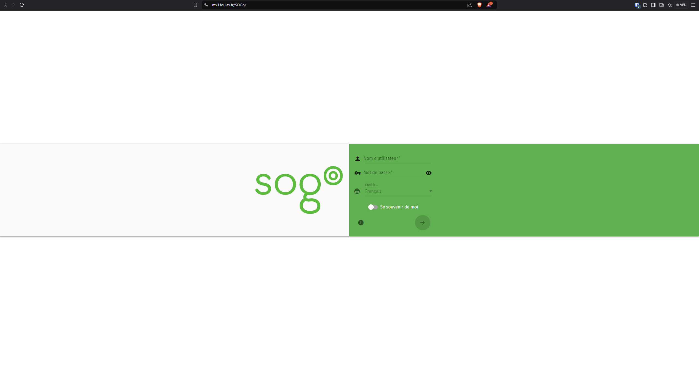
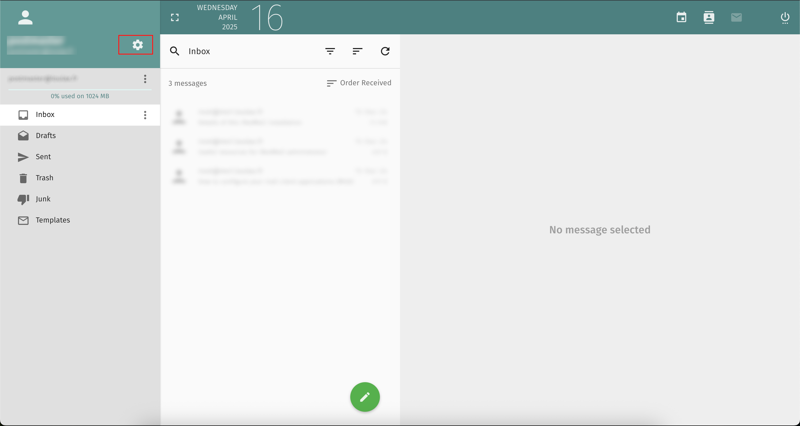
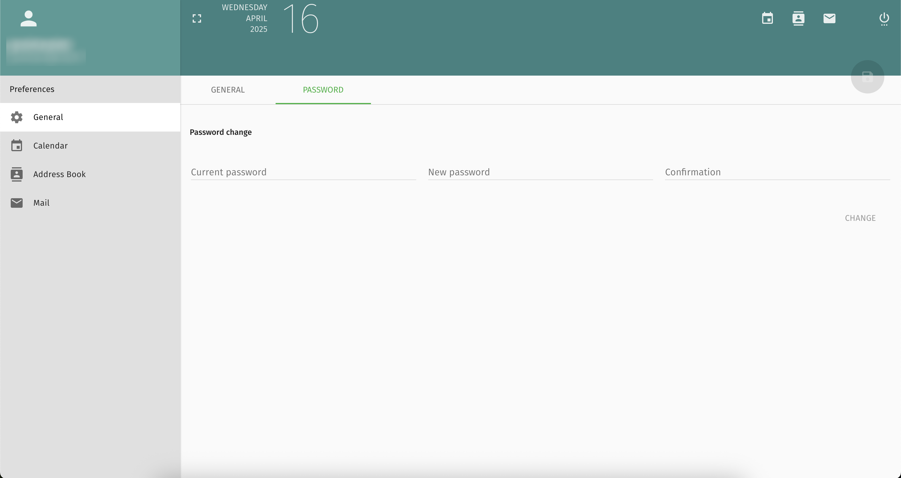

# SOGO

SOGo est un client de messagerie web autrement dit un webmail permettant initialement de lire, écrire et envoyer des mails.

Il intègre en plus des fonctionnalités comme agenda et calendrier ce qui le rapproche de clients comme Outlook ou Gmail.

Dans la plupart des situations, il se retrouve ajouté par un serveur mail pour permettre d'avoir un système de mail complet.

## Accès à SOGo

Pour y accéder, il suffit de renseigner dans la barre d'adresse de son navigateur (Chrome, Firefox, Safari, Opera...) l'adresse du serveur fournie par son prestataire et rajouter /SOGo. Exemple pour un serveur mail dont l'adresse d'accès est mx1.loulax.fr ça sera 

https://mx1.loulax.fr/SOGo

Renseigner son adresse mail et son mot de passe puis nous serons connecté au webmail.

## Changement de mot de passe

Pour pouvoir changer le mot de passe, après s'être connecté, il faudra cliquer sur la roue crantée en haut afin d'accéder aux paramètres.

Ensuite cliquer sur Password puis renseigner les différents champs et enfin cliquer sur le bouton enregistrer qui apparaîtra en vert en haut quand les champs seront correctement complétés.

